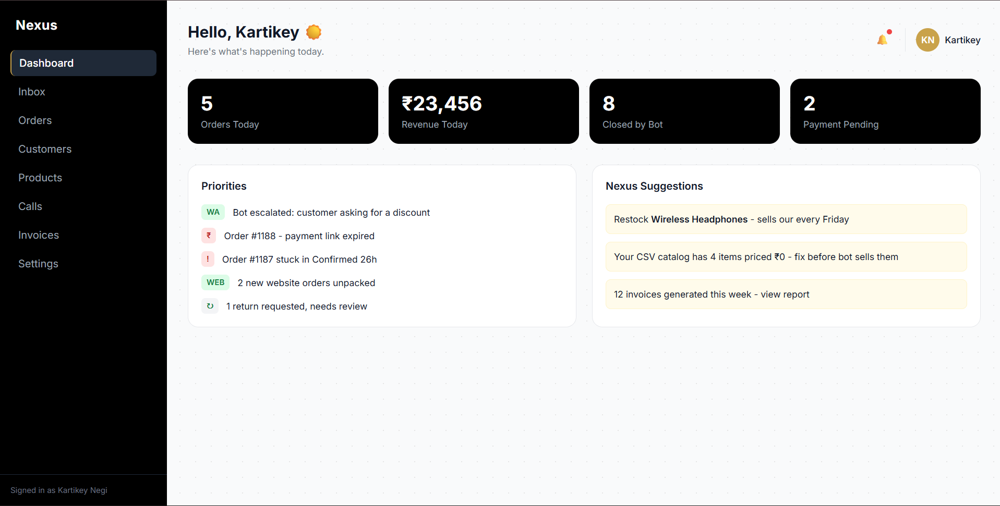

# NxtRev Commerce OS

A unified dashboard for small D2C merchants - one inbox for every order, an AI that chats, calls, and sells across WhatsApp, Instagram, and web.

## 🔗 Try it live

**[View the live demo →] ** https://kartikeynegi25.github.io/commerce-os

## Quick start

Just open the link above - no install needed. Click around: try the sidebar navigation, click into an order or a conversation, use the search bars, and try the "Mark as Packed" button on an order detail page.

## The problem

Small D2C merchants selling through WhatsApp, Instagram, and a website end up being the integration layer themselves - checking three apps, tracking payments through UPI screenshots, writing invoices by hand, and losing sales overnight because there's no one awake to reply or losing customers just becasue you are busy. Commerce OS unfies all of it into one dashboard, with an AI (Nexus) that can chat, take orders, and even place confirmation calls - escalating to the owner only when it genuinely needs to.

## Features

- **Unified Inbox** - WhatsApp, Instagram, Calls, Website messages in one feed, with live search
- **AI Order-Tracking Chatbot** - sample conversations showing Nexus quoting stock/price, confirming orders, and escalating discount requests to a human
- **AI Calling Agent** - a call transcript log showing automated COD confirmation calls, including a live escalation mid-call
- **Order Pipeline** - orders move through New → Confirmed → Packed → Shipped → Delivered, with a working button that advances an order's status live
- **Products, Invoicing, Customers** - full catalog, GST-ready invoice previews, and per-customer order history
- **Settings** - per-channel bot toggles, quiet hours, and integration connection cards
- **Fully responsive** - collapsible mobile sidebar, scrollable tables, restacking layouts

## Scope note

This is a **frontend prototype** - every page uses static mock data. There is no real backend, database, or live WhatsApp/Instagram/AI integration behind it. It was built to demonstrate the product vision and UX flows from the full Product Requirements Document, not as a production system.

## What's next

Beyond this prototype, I'm exploring this as a real product for D2C merchants - potentially including hands-on onboarding support (website setup, calling/chatbot setup, inventory organization) alongside the self-serve dashboard shown here.

## How it workd

Every page is plain HTML + Tailwind CSS (loaded via CDN, no build step), with vanilla JavaScript handling the interactive pieces - live table search/filtering, a mobile hamburger menu, an order status stepper that updates the pipeline UI on click, and an empty-state toggle. No framework was used, since the goal was a fast, dependency-free prototype a reviewer can open instantly with no setup

## AI Usage Declaration

Used claude as an AI pair-programmer throughout the build - I made every decision on structure, scope, and what to build next, wrote and debugged the code myself in the editor, and used Claude to explain new HTML/CSS/JS concepts and help with debugging.
