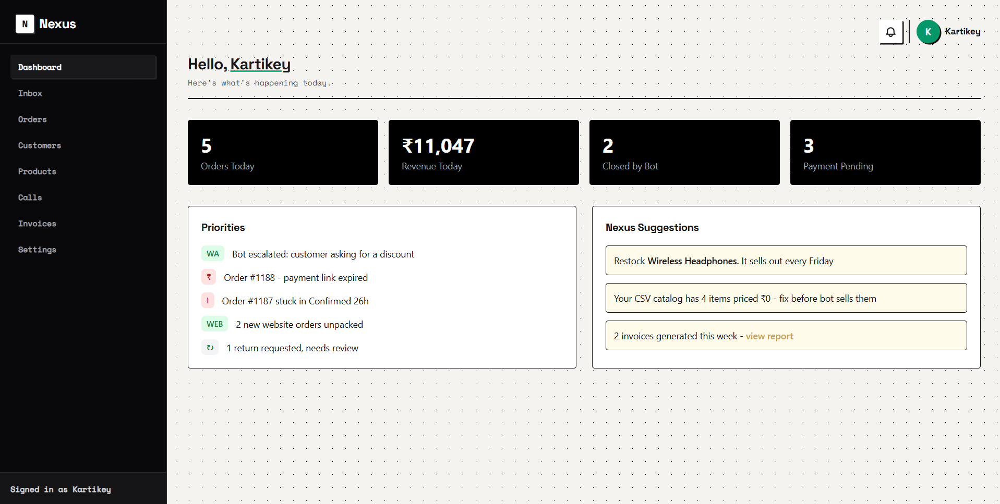

# Commerce OS

A unified dashboard for small/medium business(SMBs) - one inbox for every order, an AI that chats, calls, and sells across WhatsApp, Instagram, and web.

## 🔗 Try it

🌐 **Live Site:** https://kartikeynegi25.github.io/commerce-os

## Explore it

- Click order **#1240** or **#1229** on the Orders page to see full order details, live status updates, and an invoice preview (other rows are static, showing table variety without a full detail page built for each)
- Click the **WhatsApp** or **Instagram** rows on the Inbox page to see real chatbot conversations, you can also reply from there only, including an escalation moment (other rows are static)
- Click the **first row** on the Calls page to see a full AI call transcript
- Try the search bar on Orders, Products, Calls, Invoices, or Customers
- Try the **"Mark as Packed"** button on order #1240's detail page
- Try the **"Toggle empty state"** link on Inbox to see empty state of inbox
- Resize your browser (or check on your phone) to see the responsive mobile menu.
- Click on profile avatar to see the profile page or try clicking on notification bell
- You can also change your details from settings which will apply sitewide

## Features

- **Unified Inbox** - WhatsApp, Instagram, Calls, Website messages in one feed, with live search
- **AI Chatbot** - It will talk to customers by messaging through different platforms like insta and whatsapp you can check the chatbot demo message in inbox and also reply from there only.
- **AI Calling Agent** - It will talk to customers by calling you can check the demo call transcript in calls section.
- **Order Pipeline** - orders move through New → Confirmed → Packed → Shipped → Delivered, with a working button that advances an order's status live
- **Products, Invoicing, Customers** - full catalog, GST-ready invoice previews that you can download, and per-customer order history
- **Settings** - Bot behaviour you can set what actions you want the bot to do, quiet hours, and integration connection cards and account section to change/update details and view business profile
- **Fully responsive** - Collapsible mobile sidebar, scrollable tables, restacking layouts
- **Business Profile** - All the details and statistics for your business you can access it by clicking on profile avatar or through settings.

## What it is and what is coming next

This is a **frontend prototype** - every page uses static mock data. There is no real backend(it only works on localStorage for now), database, or live WhatsApp/Instagram/AI integration behind it. It was built to demonstrate the product vision and UX flows. I will work on further expanding it to a real product connecting backend, making the chatbot and calling agent work also giving option to connect to different apps of your choice so it can work as you want. It will also have order tracking stock management and other feature as we further work on it but that is for later phases.

## AI Usage Declaration

Used claude as an AI pair-programmer throughout the build - Wrote the code and implemented logics myself, and used Claude to explain new HTML/CSS/JS concepts as I was also learning throughout the build and also took help in debugging and fixing some errors(several genuinely tricky ones — missing ids causing silent crashes, localStorage state not persisting correctly, a nested function bug...).
